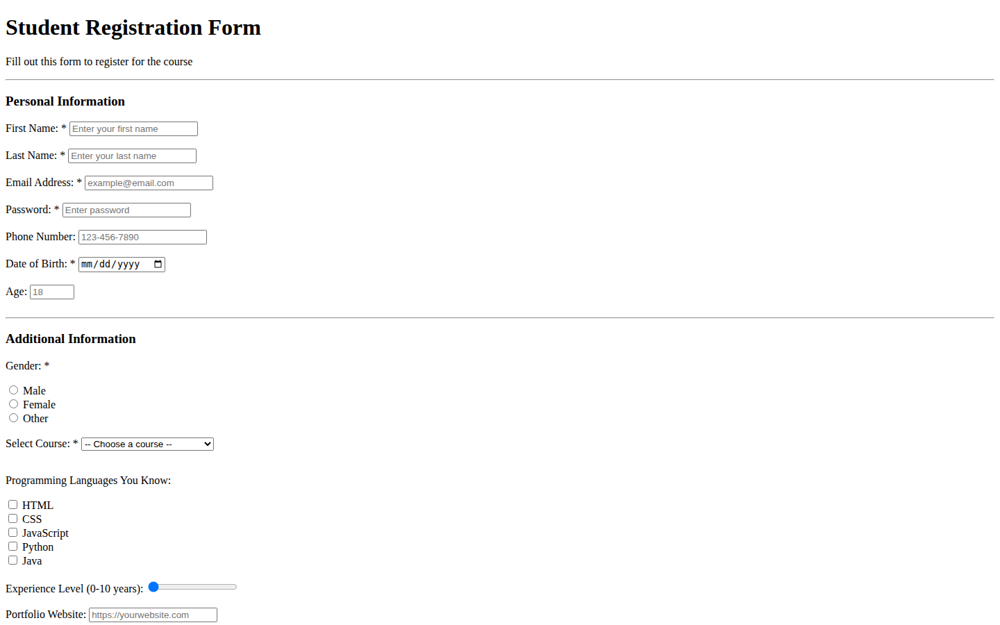

# Student Registration Form — HTML Only

The unstyled starting point of the student registration form exercise: the same fields in plain HTML, before any CSS is added. The styled version is in [form-exercise-for-students](https://github.com/Davitxxdavit/Form-Exercise-For-Students).

## What's inside

- Personal information and additional information sections
- Text, email, password, tel, date, number, url, range, color, and file inputs
- Radio buttons, checkboxes, and a select menu

## Built with

- HTML form elements

## Run locally

No build step. Open `index.html` in a browser.
